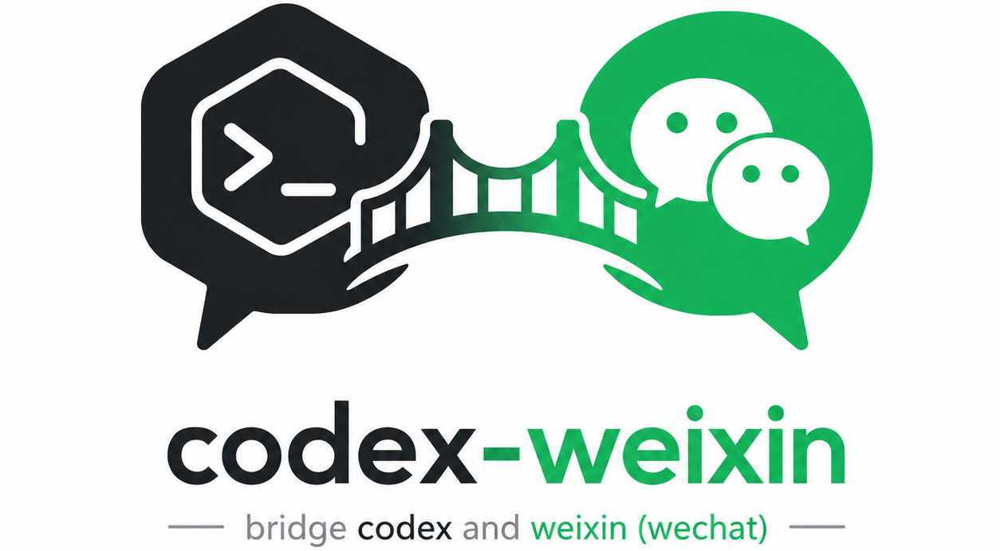

<h1 align="center">codex-weixin</h1>

<p align="center">
  
</p>

<p align="center">
  <a href="./README.md">中文</a> | <strong>English</strong>
</p>

<p align="center">
  <strong>Connect multiple personal WeChat accounts to a local OpenAI Codex installation.</strong>
</p>

`codex-weixin` is a cross-platform, local-only WeChat service dedicated to Codex. Starting it opens a Web management page where users scan a WeChat QR code, manage accounts and workspaces, and switch Codex sessions.

```text
Multiple WeChat accounts <-> codex-weixin <-> local Codex <-> allowed workspaces
```

It is not a general messaging gateway. The management page is never exposed to the LAN or public Internet.

## Feature status

Screenshots live under `docs/images/screenshots/`. The Web management screenshot is included; rows that require a phone view reserve stable filenames for later WeChat captures.

| Status | Feature | Details | Screenshot |
| --- | --- | --- | --- |
| ✅ | Local Web management | A `127.0.0.1`-only page manages WeChat accounts, sessions, workspaces, and Codex settings. | [Web sessions](docs/images/screenshots/web-session-management.png) |
| ✅ | Multiple WeChat accounts | One service runs multiple accounts with local remarks and isolated authorization, attachments, and sessions. | [Web sessions](docs/images/screenshots/web-session-management.png) |
| ✅ | Browser QR connection | Shows waiting, scanned, connected, and expired QR states. | Pending: `docs/images/screenshots/wechat-qr-login.png` |
| ✅ | Session management | Grouped account tabs, Markdown history, continued Codex threads, and create, rename, activate, reset, and delete actions. | [Web sessions](docs/images/screenshots/web-session-management.png) |
| ✅ | Web text and attachments | Send text with up to 10 files (50 MB total), with media playback, preview, and download in history. | Pending: `docs/images/screenshots/web-attachments.png` |
| ✅ | WeChat private-chat control | Supports regular messages plus `/status`, `/new`, `/bind`, `/prompt start`, `/prompt done`, and `/stop`. | Pending: `docs/images/screenshots/wechat-chat.png` |
| ✅ | WeChat media input | Accepts transcribed voice, images, audio, video, and files as local Codex attachments. | Pending: `docs/images/screenshots/wechat-media-input.png` |
| ✅ | File delivery to WeChat | Codex can return local images, videos, and files as native WeChat messages. | Pending: `docs/images/screenshots/wechat-media-output.png` |
| ✅ | Models and reasoning effort | Model-aware dropdowns loaded from app-server, including GPT-5.6 Sol, Terra, and Luna for IkunCoding. | Pending: `docs/images/screenshots/web-model-settings.png` |
| ✅ | Typing state and deduplication | Web typing state plus persistent sync cursors and message IDs prevent duplicate replies. | Pending: `docs/images/screenshots/wechat-typing.png` |
| ✅ | App-server first | New and resumed sessions prefer Codex app-server V2 and fall back to `codex exec` when unavailable. | Pending: `docs/images/screenshots/wechat-status.png` |

## Web management preview

<p align="center">
  
</p>

## Requirements

- Node.js `>=22`
- Git
- An installed and authenticated Codex CLI

```bash
npm install -g @openai/codex
codex --version
codex
```

## Install and start

Install globally from npm:

```bash
npm install -g codex-weixin
codex-weixin
```

Or install from source:

```bash
git clone https://github.com/XavierJiezou/codex-weixin.git
cd codex-weixin
npm install
npm run build
npm install -g .
codex-weixin
```

The service opens [http://127.0.0.1:8787](http://127.0.0.1:8787). To run without a global install:

```bash
npm start
```

## First connection

1. Open Settings and confirm the default and allowed Codex workspaces.
2. Select Add WeChat, scan the QR code, and confirm in WeChat.
3. Send any message to the connected account.
4. Return to WeChat Accounts and allow the pending sender.
5. Send the message again to start a Codex turn.

Repeat the QR flow to add more accounts. Every account has its own monitor, sender authorization, inbound directory, and managed-session state. A failed account does not stop the others.

## Session management

The Sessions page manages conversations created and used by this server. It does not scan or take ownership of every Codex conversation created in other terminals.

Selecting a session reads its user messages and final replies from Codex's own persisted thread. The Web composer can submit text and multiple files as one turn and continues that same thread, so context remains shared with later WeChat messages. Uploads are isolated by account and session under `~/.codex-weixin/inbound/`, with at most 10 files and 50 MB total per turn.

The UI does not display `@im.bot`, `@im.wechat`, or Codex thread IDs. The first two are internal iLink routing identifiers, not profile names. Each account can have a local remark edited from the WeChat Accounts page; the remark is reused by session tabs, with `WeChat Account 1` used only as a fallback. The current QR and messaging APIs do not expose WeChat nicknames, avatars, or a profile lookup endpoint, so the page uses a default icon while retaining those identifiers only in local state for correct routing.

- Each authorized WeChat account has one active session and may own multiple named sessions.
- Activate chooses which Codex thread receives the sender's next message.
- Reset clears the recorded thread so the next message starts fresh context.
- Delete removes only the bridge record, not Codex's own history files.
- `/new` creates a new managed session for the current sender.

## WeChat commands

```text
/help                         Show commands
/status                       Show session, workspace, thread, backend, effective model, and reasoning effort
/bind <absolute-path>          Bind to an allowed workspace
/new                          Create a new managed Codex session
/prompt start                 Buffer multiple WeChat messages
/prompt done                  Submit the buffer as one Codex turn
/stop                         Interrupt the current Codex task
```

Regular messages enter the active session. Images, files, videos, and voice/audio without transcription are saved under the account's inbound directory and added to the prompt by local path. WeChat voice transcription is preferred when available.

## Sending local files

Codex can request local-file delivery in its final response:

````text
```codex-weixin-actions
{
  "send": [
    { "type": "image", "path": "/absolute/path/chart.png" },
    { "type": "video", "path": "/absolute/path/demo.mp4" },
    { "type": "file", "path": "/absolute/path/report.pdf" }
  ]
}
```
````

Only absolute local paths are accepted. Native outbound types are `image`, `video`, and `file`; audio is sent as a regular file. Remote URLs are not uploaded as local files.

## Codex backend

The default `codexBackend` is `auto`. On the first Codex message, the service starts one persistent `codex app-server --stdio` process and uses the current `initialize`, `thread/*`, and `turn/*` protocol. New and resumed conversations prefer app-server; startup, handshake, or request failures automatically fall back to `codex exec` or `codex exec resume`.

WeChat does not currently expose Codex approval prompts, so app-server uses `approvalPolicy: "never"` and operates only within the configured Codex sandbox instead of waiting for an approval that cannot be answered in WeChat. The management page can still pin the backend to `app-server` or `exec` for diagnostics.

## Models and reasoning effort

The Settings page loads available models and model-specific reasoning efforts from Codex app-server. Leaving a field on "Use Codex settings" preserves the Codex configuration; choosing and saving an explicit value applies it to later Web and WeChat turns.

The IkunCoding provider also exposes `gpt-5.6-sol`, `gpt-5.6-terra`, and `gpt-5.6-luna`. These options remain available after switching to another model. Send `/status` in WeChat to inspect the effective model and reasoning effort.

## Local data

Service state and the default Codex workspace share this directory:

```text
~/.codex-weixin/
  accounts/                 One credential file per WeChat account
  runtime/<account-id>/     Sender authorization and managed sessions
  inbound/<account-id>/     Inbound WeChat attachments
  config.json               Codex and workspace configuration
  logs/
```

Do not commit or share this directory. The management API never returns WeChat tokens to the browser.

## Startup settings

The server always binds to `127.0.0.1`. Environment variables can change its port and state directory or disable automatic browser opening:

```text
CODEX_WEIXIN_PORT=8787
CODEX_WEIXIN_STATE_DIR=/absolute/private/path
CODEX_WEIXIN_OPEN=0
```

## Security model

- Non-local Host and Origin values are rejected.
- Every mutating API call requires an in-memory page token.
- WeChat credentials never reach the management page.
- Unknown senders are denied until explicitly allowed.
- `/bind` accepts only absolute paths under the workspace allowlist.
- `danger-full-access` bypasses the Codex filesystem sandbox and must be enabled only when full-machine access is acceptable.
- Concurrent accounts share local compute resources and Codex quotas.

## Development

```bash
npm install
npm run dev
npm test
npm run typecheck
npm run build
```

The project is a clean-room independent implementation under the MIT License. Its iLink integration shape references `Tencent/openclaw-weixin`, along with public Codex/WeChat projects for app-server, media-transfer, and security-boundary practices. No AGPL source code was copied.

See [CHANGELOG.md](./CHANGELOG.md) for release history.
