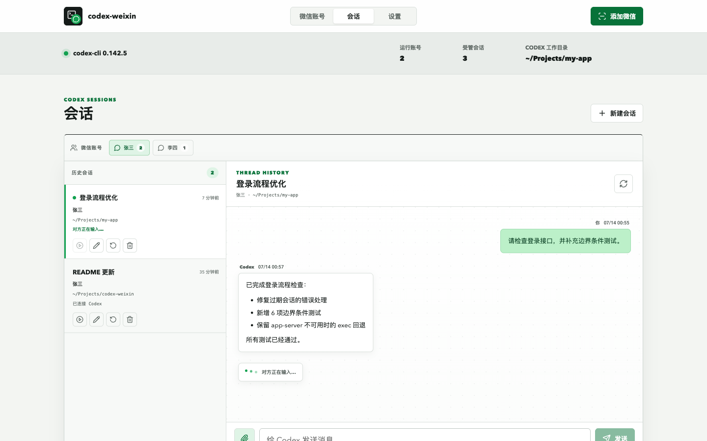

<h1 align="center">codex-weixin</h1>

<p align="center">
  
</p>

<p align="center">
  <strong>中文</strong> | <a href="./README.en.md">English</a>
</p>

<p align="center">
  <strong>把个人微信账号接入本机 OpenAI Codex。</strong>
</p>


`codex-weixin` 是一个跨平台、本机运行的微信到 Codex 专用服务。启动后会打开 Web 管理页；用户在页面扫码登录微信，即可从微信私聊控制本机 Codex、管理工作目录和切换会话。

```text
微信账号 <-> codex-weixin <-> 本机 Codex <-> 允许的工作目录
```

它不是通用消息网关，不接入其他聊天平台，也不把管理页面开放到局域网或公网。

## 功能状态

截图统一放在 `docs/images/screenshots/`。Web 管理页截图已补齐；需要手机微信画面的功能保留了固定文件名，后续可直接补图。

| 状态 | 功能 | 说明 | 截图 |
| --- | --- | --- | --- |
| ✅ | 本机 Web 管理 | 页面只监听 `127.0.0.1`，集中管理微信账号、会话、工作目录和 Codex 设置。 | [Web 会话管理](docs/images/screenshots/web-session-management.png) |
| ✅ | 多微信账号 | 一个服务并行运行多个微信账号，支持本机备注、独立授权、独立附件与会话状态。 | [Web 会话管理](docs/images/screenshots/web-session-management.png) |
| ✅ | 网页扫码接入 | 显示等待扫码、已扫码、已连接和二维码过期状态。 | 待补：`docs/images/screenshots/wechat-qr-login.png` |
| ✅ | 会话管理 | 按微信账号分类，查看 Markdown 历史并继续同一 Codex thread；支持新建、重命名、切换、重置和删除。 | [Web 会话管理](docs/images/screenshots/web-session-management.png) |
| ✅ | Web 文本与附件 | 一次发送文本和最多 10 个文件（合计 50 MB），历史中可播放、预览或下载媒体。 | 待补：`docs/images/screenshots/web-attachments.png` |
| ✅ | 微信私聊控制 | 支持普通消息和 `/status`、`/new`、`/bind`、`/model`、`/effort`、`/prompt start`、`/prompt done`、`/stop`。 | 待补：`docs/images/screenshots/wechat-chat.png` |
| ✅ | 微信多媒体输入 | 接收语音转写、图片、音频、视频和文件，并以本机附件交给 Codex。 | 待补：`docs/images/screenshots/wechat-media-input.png` |
| ✅ | 文件回传微信 | Codex 可把本机图片、视频和文件作为微信原生消息发回。 | 待补：`docs/images/screenshots/wechat-media-output.png` |
| ✅ | 模型和推理强度 | 从 app-server 读取模型能力并通过下拉列表切换；IkunCoding 支持 GPT-5.6 Sol、Terra 和 Luna。 | 待补：`docs/images/screenshots/web-model-settings.png` |
| ✅ | 过程进度 | 默认开启；Codex 处理过程实时发送到微信，并在 Web 中折叠显示处理用时，最终答案保持完整。 | 待补：`docs/images/screenshots/web-process-progress.png` |
| ✅ | 输入状态与去重 | Web 显示“对方正在输入…”，并持久记录同步游标和消息 ID，防止重复回复。 | 待补：`docs/images/screenshots/wechat-typing.png` |
| ✅ | App-server 优先 | 新旧会话优先使用 Codex app-server V2；不可用时自动回退到 `codex exec`。 | 待补：`docs/images/screenshots/wechat-status.png` |
| ✅ | Web 自动更新 | 自动选择 npm 官方源或 npmmirror，更新当前实际运行的 npm runtime，校验后重启并恢复连接。 | 待补：`docs/images/screenshots/web-auto-update.png` |

## Web 管理页预览

<p align="center">
  
</p>

## 环境要求

- Node.js `>=22`
- Git
- 已安装并登录 Codex CLI

```bash
npm install -g @openai/codex
codex --version
codex
```

## 安装

推荐从 npm 全局安装：

```bash
npm install -g codex-weixin
codex-weixin
```

也可以从源码安装：

```bash
git clone https://github.com/XavierJiezou/codex-weixin.git
cd codex-weixin
npm install
npm run build
npm install -g .
```

服务会自动打开 [http://127.0.0.1:8787](http://127.0.0.1:8787)。如果不希望全局安装，也可以在项目目录运行：

```bash
npm start
```

## 第一次接入微信

1. 打开管理页，在“设置”中确认 Codex 默认工作目录和允许的工作目录。
2. 点击“添加微信”，使用微信扫描页面二维码并确认登录。
3. 在微信中给新接入的账号发送任意消息。
4. 回到“微信账号”，允许页面中出现的待授权联系人。
5. 再次从微信发送消息，Codex 会在默认工作目录中开始处理。

继续添加账号时重复扫码即可。每个账号都有独立的轮询任务、联系人授权、入站文件和会话状态；单个账号发生错误不会停止其他账号。同一个微信账号因登录过期等原因重新扫码时，会刷新原账号凭据并保留本机备注、授权和会话，不会创建新的空账号。

## 会话管理

“会话”页面只管理由本服务创建和使用的 Codex 会话，不扫描或接管其他终端产生的全部 Codex 历史记录。

选择一个会话后，右侧会从 Codex 自身保存的 thread 中读取历史用户消息和最终回复。聊天标题下方可以为当前会话选择模型、推理强度和过程进度，或继续继承全局设置；这与微信 `/model`、`/effort`、`/stream` 共用同一份会话配置。过程进度默认开启，在 Web 中折叠展示并记录处理用时，最终答案仍作为一个完整回复显示。可以直接在页面底部继续聊天，并通过回形针按钮将文本提示词和多个文件作为同一个 turn 发送；Web 和微信共用同一个 thread，上下文会保持连续。上传文件按微信账号和会话隔离保存在 `~/.codex-weixin/inbound/`，每次最多 10 个、合计不超过 50 MB。

页面默认使用账号备注，不把内部 ID 当作账号名称。展开账号卡片中的“账号 ID”可以查看 iLink Bot ID 和 User ID；Codex thread id 仍不在普通页面显示。可以在“微信账号”页面给账号设置只保存在本机的备注；备注会同步用于会话标签。未设置备注时才使用“微信账号 1”这类默认名称。当前扫码和消息接口没有提供微信昵称、头像或个人资料查询能力，因此页面使用默认图标。

- 每个已授权微信账号有一个当前活动会话，也可以拥有多个命名会话。
- “切换”决定该联系人下一条微信消息继续哪个 Codex thread。
- “重置”清空本服务记录的 thread，下一条消息创建新上下文。
- “删除”只删除本服务中的会话记录，不删除 Codex 自身保存的历史文件。
- 微信中的 `/new` 会立即为当前联系人创建新的受管会话。

## 微信内命令

```text
/help                         查看命令
/status                       查看当前会话、工作目录、thread、backend、实际模型和推理强度
/bind <absolute-path>          绑定到允许列表内的工作目录
/new                          创建新的受管 Codex 会话
/model                        查看当前模型和可用模型
/model <序号|模型 ID|default>  切换当前会话模型，或恢复继承设置
/effort                       查看当前模型支持的推理强度
/effort <序号|强度|default>    切换当前会话推理强度，或恢复继承设置
/stream                       查看当前会话的过程进度设置
/stream <on|off|default>       开启、关闭过程进度，或恢复继承全局设置
/prompt start                 开始缓冲多条微信消息
/prompt done                  将缓冲内容作为一次 Codex turn 提交
/stop                         中断当前 Codex 任务
```

普通消息直接进入当前活动会话。图片、文件、视频和无转写语音会先保存到账号独立的入站目录，再以本地路径加入 prompt；有微信转写文本的语音优先使用转写文本。

## 文件回传

Codex 可以在最终回复中声明需要发送的本机文件：

````text
```codex-weixin-actions
{
  "send": [
    { "type": "image", "path": "/absolute/path/chart.png" },
    { "type": "video", "path": "/absolute/path/demo.mp4" },
    { "type": "file", "path": "/absolute/path/report.pdf" }
  ]
}
```
````

只接受本机绝对路径。原生出站类型为 `image`、`video` 和 `file`；音频按普通文件发送。远程 URL 不会被当作本机文件上传。

## Codex 后端

默认的 `codexBackend` 是 `auto`。第一次收到 Codex 消息时，服务会启动一个持久的 `codex app-server --stdio` 进程，并使用新版 `initialize`、`thread/*` 和 `turn/*` 协议。新会话和已有会话都优先通过 app-server 运行；如果 app-server 无法启动、握手或处理请求，会自动回退到 `codex exec` 或 `codex exec resume`。

微信端目前没有 Codex 审批弹窗，因此 app-server 使用 `approvalPolicy: "never"`，只在现有 Codex sandbox 权限内执行，不会等待一个无法在微信中回答的本机审批请求。管理页仍可把后端固定为 `app-server` 或 `exec`，用于排查问题。

## 模型和推理强度

“设置”页面会从 Codex app-server 读取可用模型和各模型支持的推理强度。选择“沿用 Codex 设置”时使用 Codex 自身配置；选择具体模型或推理强度并保存后，后续 Web 和微信消息都会使用该配置。

微信中发送 `/model` 或 `/effort` 可以查看带序号的选项，再用序号或英文 ID 切换。微信端设置只覆盖当前受管会话，不影响其他微信账号、联系人或会话；发送 `/model default`、`/effort default` 可恢复继承 Web/Codex 设置。Web 继续该会话时也会沿用这份会话设置。

IkunCoding 提供方会额外显示 `gpt-5.6-sol`、`gpt-5.6-terra` 和 `gpt-5.6-luna`。切换到其他模型后，这三项仍会保留在下拉列表和微信 `/model` 列表中。微信发送 `/status` 可以查看当前生效的模型和推理强度。

## 本地数据

服务状态和默认 Codex 工作目录统一放在：

```text
~/.codex-weixin/
  accounts/                 微信账号凭据，每个账号一个文件
  runtime/<account-id>/     联系人授权和受管会话状态
  inbound/<account-id>/     微信入站附件
  config.json               Codex 和工作区配置
  logs/
```

不要提交或分享该目录。管理 API 不会把微信 token 返回给浏览器。

## 启动设置

服务始终只绑定 `127.0.0.1`。可以通过环境变量改变端口、状态目录或关闭自动打开浏览器：

```text
CODEX_WEIXIN_PORT=8787
CODEX_WEIXIN_STATE_DIR=/absolute/private/path
CODEX_WEIXIN_OPEN=0
```

Windows PowerShell 示例：

```powershell
$env:CODEX_WEIXIN_OPEN="0"
codex-weixin
```

## 安全边界

- Web 服务只监听本机，拒绝非本机 Host 和 Origin。
- 所有修改 API 都需要页面运行时临时令牌。
- 微信凭据永远不返回管理页面。
- 未知联系人默认拒绝，必须在管理页明确允许。
- `/bind` 只能选择允许列表内的绝对工作目录。
- `danger-full-access` 会绕过 Codex 文件系统 sandbox；只有接受整机访问风险时才启用。
- 多账号可以并行触发 Codex，会共同占用本机 CPU、内存和 Codex 配额。

## 开发

```bash
npm install
npm run dev
npm test
npm run typecheck
npm run build
```

开发入口同样只启动本机 Web 服务。浏览器页面、JSON API、多账号运行时、扫码状态机和受管会话都有自动化测试。

源码目录通过 `npm run dev` 或 `npm start` 启动时，Web 只检查新版本，不会自动安装；请通过 Git 更新源码后重新构建。全局安装和独立 `node_modules/codex-weixin` runtime 会更新当前实际运行的 npm prefix，并在重启前验证目标版本和服务入口。

## 参考与许可

项目是独立实现，微信 iLink 接入形态参考 `Tencent/openclaw-weixin`，并参考了公开的 Codex/微信桥接项目在 Codex app-server、媒体传输和安全边界方面的实践。项目未复制 AGPL 项目源码，使用 MIT License。

版本变更见 [CHANGELOG.md](./CHANGELOG.md)。
